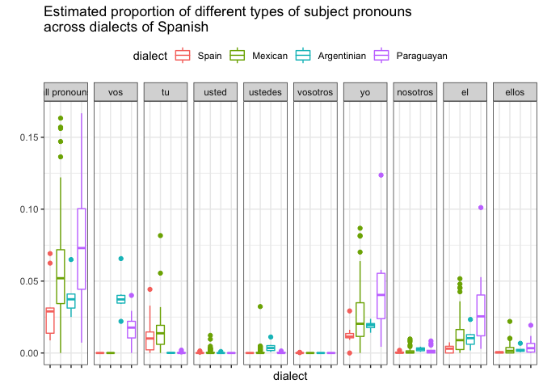
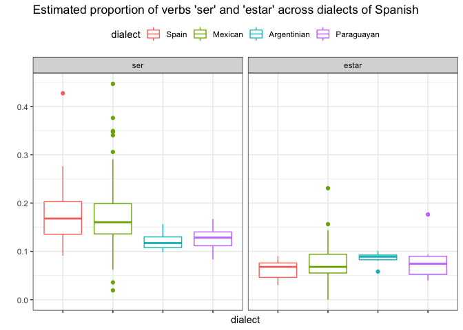
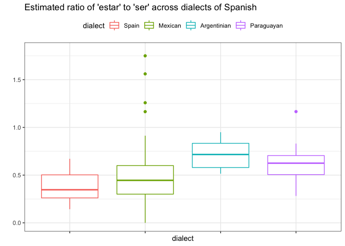
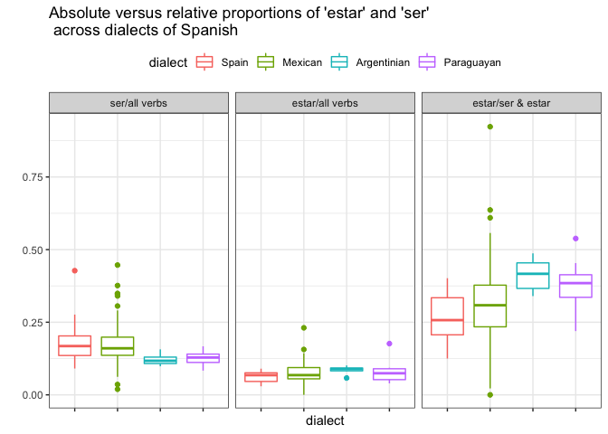
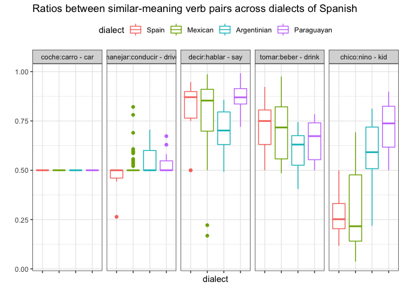

Codreview for Insights interview
================

available at: <https://github.com/HannahForsythe/span_dialects>

author: Hannah Forsythe

date: 20-April-2020

description: Exploratory analysis of dialectal differences across
Spanish. Figure 1 explores the utility of two potential features for
characterizing dialectal differences: (i) overall rates subject pronoun
use, and (ii) rates of different types of subject pronouns

Figures 2-4 explore the utility of a using the frequency of verbs
‘estar’ and ‘ser’ (‘be’) to distinguish between dialects, or their
RELATIVE frequency.

Figure 5 looks at the ratios between other pairs of similar-meaning
words.

future goals: use these insights to produce a classifier capable of
identifying a dialect, given an utterance of reasonable length.

potential application: allow an ASR (Alexa, Siri, etc.) to detect when a
different dialect is being spoken than expected, so it can prompt the
user to change settings. For example, when set to Mexican Spanish, the
ASR should be able to detect when someone is speaking a variety of
Spanish with non-Mexican features.

``` r
####################
#libraries
####################
library(dplyr)
```

    ## 
    ## Attaching package: 'dplyr'

    ## The following objects are masked from 'package:stats':
    ## 
    ##     filter, lag

    ## The following objects are masked from 'package:base':
    ## 
    ##     intersect, setdiff, setequal, union

``` r
library(plyr)
```

    ## -------------------------------------------------------------------------

    ## You have loaded plyr after dplyr - this is likely to cause problems.
    ## If you need functions from both plyr and dplyr, please load plyr first, then dplyr:
    ## library(plyr); library(dplyr)

    ## -------------------------------------------------------------------------

    ## 
    ## Attaching package: 'plyr'

    ## The following objects are masked from 'package:dplyr':
    ## 
    ##     arrange, count, desc, failwith, id, mutate, rename, summarise,
    ##     summarize

``` r
library(pryr)
library(ggplot2)
library(stringr)
library(lme4)
```

    ## Loading required package: Matrix

``` r
library(reshape)
```

    ## 
    ## Attaching package: 'reshape'

    ## The following object is masked from 'package:Matrix':
    ## 
    ##     expand

    ## The following objects are masked from 'package:plyr':
    ## 
    ##     rename, round_any

    ## The following object is masked from 'package:dplyr':
    ## 
    ##     rename

``` r
library(readr)
```

data: The data for this exploratory analysis comes from transcripts of
free-form parent-child interactions in 4 different dialects, compiled
from 6 corpora available at
<https://childes.talkbank.org/access/Spanish/> and 2 private corpora
(anticipated release: Sept. 2020). Each utterance has been tagged for
speaker and the words have been passed through the part-of-speech tagger
designed for Spanish by Brian MacWhinney and described here:
<https://talkbank.org/manuals/MOR.pdf> . An important feature of this
tagger is that it identifies verb stems (ex. esta-) so that different
inflections of the same verb (ex. estoy, ‘(I) am’, estás ‘(you) are’,
etc.) can be easily grouped together. I have used the accompanying free
software called CLAN (<http://dali.talkbank.org/clan/>) to put the data
into csv format, with one line per utterance.

The code below cleans the data and extracts the following variables: a)
file: name of the transcript b) line: each utterance appears on a
separate line c) participant: what kind of person is speaking (parent,
investigator, etc.) For now, we only include adults; no children. d)
speaker: the speaker’s unique ID e) environment: the utterance,
including all the words that were said and the part-of-speech tags f)
dyad: this variable is used to identify some mother-child pairs g)
dialect: For now, this includes Mexican, Argentinian, Spain, and
Paraguayan Spanish.

``` r
################
#Data prep - Schmitt Miller corpus (Mexico City - 24 children, approx 60 adults )
###############
#citation: Forsythe, H., D. Greeson and C. Schmitt (to appear). "How preschoolers acquire the null-overt contrast in Mexican Spanish: Evidence from production," Colomina-Almiñana, J. & S. Sessarego (eds.). Patterns in Spanish: Structure, Context and Development. Amsterdam/Philadelphia: John Benjamins. 
#link to paper: https://hannahforsythe.weebly.com/uploads/3/0/9/7/30974925/frosytheetal-2019-hlsproceedings-revised.pdf
#This data is private, pending anonymization

schmill <- read_delim("SchmittMiller/allSchmittMiller-all.csv", '\t', col_names=c("file", "language", "corpus", "participant", "age", "sex", "empty1", "empty2", "role", "empty3", "empty4", "line", "token", "environment"))

#remove duplicate rows
schmill <- distinct(schmill)

#check participant codes
levels(as.factor(schmill$participant))

#As with the other files, select only adult speech
CDMX1 <- schmill %>% filter(participant %in% c("ADU", "FAT", "FRI", "LAD", "MOM", "MOT", "OTH", "OTH1", "SIS", "SP01", "TEA", "WOM")) %>% 
  select(file, line, participant, environment)
#assign dialect variable:
CDMX1$dialect <- as.factor("Mexican")

#assign speaker variable: 
  #extract child code from first three characters of filename and use it to make the speaker ID
  CDMX1$speaker <- str_extract(CDMX1$file, "[A-Z][A-Z][A-Z]")
  #concatenate with participant code to make the speaker ID
  CDMX1$speaker <- as.factor(paste0(CDMX1$participant, "-", CDMX1$speaker))

################
#Data prep - Villa21 corpus (mixed Paraguayan/Argentinian Spanish, 9 children, 12 adults)
################
#citation: This data is private for the moment
LI <- read.csv("Villa21/nullovert123-Lucero-grk.csv")
LI$dyad <- as.factor("LI")

ODOG <- read.csv("Villa21/nullovert123-Oscar-grk.csv")
ODOG$dyad <- as.factor("ODOG")

AG <- read.csv("Villa21/nullovert123-Araceli-hcf.csv")
AG$dyad <- as.factor("AG")

GG <- read.csv("Villa21/nullovert123-Gaston-hcf.csv")
GG$dyad <- as.factor("GG")

AC <- read.csv("Villa21/nullovert123-Angel-hcf.csv")
AC$dyad <- as.factor("AC")

BB <- read.csv("Villa21/nullovert123-Barbara-hcf.csv")
BB$dyad <- as.factor("BB")

DDZF <- read.csv("Villa21/nullovert123-Dante-hcf.csv")
DDZF$dyad <- as.factor("DDZF")

ABB <- read.csv("Villa21/nullovert123-Alexandra-hcf.csv")
ABB$dyad <- as.factor("ABB")

EGC <- read.csv("Villa21/nullovert123-Elias-hcf.csv")
EGC$dyad <- as.factor("EGC")

Villa21 <- rbind.fill(AG, ABB, EGC, GG, AC, BB, LI, DDZF, ODOG)

#replace the problematic column names
names(Villa21) <- revalue(names(Villa21), c("."="empty", "..1"="empty1", "..2"="empty2", "..3"="empty3"))

####NOTE:
####parents in this corpus speak Paraguayan Spanish, investigators speak Argentinian Spanish, and kids speak a mix
####speaker is coded differently for investigators, so we will prepare data SEPARATELY for each dialect  

#As with the other files, select only adult speech main lines (no comments or grammatical codes)
PS <- Villa21 %>% filter(participant %in% c("MOT", "MOT2", "FAT") & tier %in% "%mor:") %>% 
  select(file, line, participant, environment, dyad)
  #assign dialect variable:
  PS$dialect <- as.factor("Paraguayan")
  #assign speaker variable
  PS$speaker <- as.factor(paste0(PS$participant, "-", PS$dyad))

ArgS <- Villa21 %>% filter(participant %in% c("INV") & tier %in% "%mor:") %>% 
  select(file, line, participant, environment, dyad)
  #assign dialect variable:
  ArgS$dialect <- as.factor("Argentinian")
  #assign speaker variable: Detect which investigator code appears in the filename and use it as speaker ID
    inv_codes <- c("-EB|-SDS|-MDLR|-ALC|-MMU|-MM")
    ArgS$speaker <- as.factor(str_extract(ArgS$file, inv_codes))
    #drop lines where filename improperly left out the investigator code
    ArgS <- subset(ArgS, !is.na(ArgS$speaker))
    #correct improper tag -MM to -MMU
    ArgS$speaker <- revalue(ArgS$speaker, c("-MM"="-MMU"))
    #concatenate with participant code, to be formatted like the other speaker IDs
    ArgS$speaker <- as.factor(paste0(ArgS$participant, ArgS$speaker))

    
################
#Data prep - Diez Itza corpus (Spain (Oviedo) - 2 adult speakers, 20 children)
################
#citation: Diez-Itza, E. (1995). Procesos fonológicos en la adquisición del español como lengua materna. In J.M. Ruiz, P. Sheerin, & E. González-Cascos (Eds.), Actas del XI Congreso Nacional de Linguistica Aplicada. Valladolid:Universidad de Valladolid.
#https://childes.talkbank.org/access/Spanish/DiezItza.html
  
diezitza <-read.csv("DiezItza/DiezItza_all.csv")

#As with the other files, select only adult speech main lines (no comments or grammatical codes)
Spain1 <- diezitza %>% filter(participant %in% c("MOT", "INV") & tier %in% "%mor:") %>% 
  select(file, line, participant, environment)
  #assign dialect variable:
  Spain1$dialect <- as.factor("Spain")
  #assign speaker variables
  Spain1$speaker <- as.factor(paste0(Spain1$participant, "-DZIZ"))
      
################
#Data prep - Linaza corpus (Spain (Madrid) - 2 adult speakers, 1 child)
################
#citation: Linaza, J., Sebastián, M. E., & del Barrio, C. (1981). Lenguaje, comunicación y comprensión. La adquisición del lenguaje. Monografía de Infancia y Aprendizaje, 195-198.
#https://childes.talkbank.org/access/Spanish/Linaza.html
  linaza <-read.csv("Linaza/Linaza_all.csv")
  #check participant codes
  levels(linaza$participant)
  
  #As with the other files, select only adult speech main lines (no comments or grammatical codes)
  Spain2 <- linaza %>% filter(participant %in% c("ADU", "ANA", "CUI", "MAD", "PAD") & tier %in% "%mor:") %>% 
    select(file, line, participant, environment)
  #assign dialect variable:
  Spain2$dialect <- as.factor("Spain")
  #assign speaker variables
  Spain2$speaker <- as.factor(paste0(Spain2$participant, "-LIN"))
  
################
#Data prep - OreaPine corpus (Spain (Madrid) - 2 adult speakers, 2 children)
################
#citation: Aguado-Orea, J., & Pine, J. M. (2015). Comparing different models of the development of verb inflection in early child Spanish. PloS one, 10(3), e0119613.
#https://childes.talkbank.org/access/Spanish/OreaPine.html
#prep each kid separately, so "FAT" and "MOT" participants can be identified as different speakers
  
  #####Lucia
  lucia <- read.csv("OreaPine/Lucia/OreaPine-Lucia.csv")
  
  #check participant codes
  levels(lucia$participant)
  
  #As with the other files, select only adult speech main lines (no comments or grammatical codes)
  lucia <- lucia %>% filter(participant %in% c("FAT", "MOT") & tier %in% "%mor:") %>% 
    select(file, line, participant, environment)
  #assign dialect variable:
  lucia$dialect <- as.factor("Spain")
  #assign speaker variables
  lucia$speaker <- as.factor(paste0(lucia$participant, "-LUC"))
  
  #####Juan
  #Juan has 2 files, neither with headers. read them in with headers and combine
  juan1 <- read_delim("OreaPine/Juan/OreaPine-Juan011021_020207.csv", ',', col_names=c("file", "language", "corpus", "participant", "age", "sex", "empty1", "empty2", "role", "empty3", "empty4", "line", "token", "environment"))
  juan2 <- read_delim("OreaPine/Juan/OreaPine-Juan020211_020529b.csv", ',', col_names=c("file", "language", "corpus", "participant", "age", "sex", "empty1", "empty2", "role", "empty3", "empty4", "line", "token", "environment"))
  juan12 <- rbind(juan1, juan2)
  
  #Juan files have duplicate rows; remove them
  juan12 <- distinct(juan12)
  
  #check participant codes
  levels(as.factor(juan12$participant))
  
  #As with the other files, select only adult speech
  juan <- juan12 %>% filter(participant %in% c("FAT", "MOT", "AB2", "ABU", "TI1", "TI2", "TI3", "VEC")) %>% 
    select(file, line, participant, environment)
  #assign dialect variable:
  juan$dialect <- as.factor("Spain")
  #assign speaker variables
  juan$speaker <- as.factor(paste0(juan$participant, "-JUA"))
  
  ######Juan and Lucia
  #join kids into a single dataframe
  Spain3 <- rbind(lucia, juan)
  
################
#Data prep - FernAguado corpus (Spain (Pamplona) - 40 adult speakers, 40 children)
################
#citation: not given
#https://childes.talkbank.org/access/Spanish/FernAguado.html
  
  fernaguado <-read_delim("FernAguado/allFernAguado.csv", '\t', col_names=c("file", "language", "corpus", "participant", "age", "sex", "empty1", "empty2", "role", "empty3", "empty4", "line", "token", "environment"))
  
  #fernaguado files have duplicate rows; remove them
  fernaguado <- distinct(fernaguado)
  
  #check participant codes
  levels(as.factor(fernaguado$participant))
  
  #As with the other files, select only adult speech
  Spain4 <- fernaguado %>% filter(participant %in% c("FAT", "MOT", "INV")) %>% 
    select(file, line, participant, environment)
  #assign dialect variable:
  Spain4$dialect <- as.factor("Spain")
  
  #assign speaker variable: 
    #extract child name from beginning of filename and use it to make the speaker ID
    Spain4$speaker <- as.factor(str_extract(Spain4$file, "[:alpha:]+"))
    #concatenate with participant code to make the speaker ID
    Spain4$speaker <- as.factor(paste0(Spain4$participant, Spain4$speaker))
  
################
#Data prep - Remedi corpus (Argentinian Spanish from Córdoba - 1 adult speaker, 1 child)
################
#citation: not given
#https://childes.talkbank.org/access/Spanish/Remedi.html
    
remedi <- read.csv("Remedi/Remedi.csv", header=FALSE)
                   
names(remedi) <- c("file", "language", "corpus", "participant", "age", "sex", "empty1", "SES", "role", "empty3", "empty4", "line", "token", "environment")
    
#remedi files have duplicate rows; remove them
remedi <- distinct(remedi)

#check participant codes
levels(as.factor(remedi$participant))

#As with the other files, select only adult speech
ArgS2 <- remedi %>% filter(participant %in% c("PAD", "ALE")) %>% 
  select(file, line, participant, environment)
#assign dialect variable:
ArgS2$dialect <- as.factor("Argentinian")

#assign speaker variable: 
  #change participant codes to reflect their roles
  ArgS2$participant <- revalue(ArgS2$participant, c("PAD"="FAT", "ALE"="MOT"))
  #concatenate participant code with child's code to make the speaker ID
  ArgS2$speaker <- as.factor(paste0(ArgS2$participant, "-Vicky"))
    
################
#Data prep - Jackson Thal corpus (Mexican Spanish from Querétaro and Mexico City - 
################
#citation: Jackson-Maldonado, D. & Thal, D. (1993). Lenguaje y Cognición en los Primeros Años de Vida. Project funded by the John D. and Catherine T. MacArthur Foundation and CONACYT, Mexico
#https://childes.talkbank.org/access/Spanish/JacksonThal.html
#Note: missing a lot of accents. Will undercount tú and está.
  
  jacksonthal_mex <- read_delim("JacksonThal/JacksonThal_mex.csv", '\t', col_names=c("file", "language", "corpus", "participant", "age", "sex", "empty1", "empty2", "role", "empty3", "empty4", "line", "token", "environment"))

  #remove duplicate rows
  jacksonthal_mex <- distinct(jacksonthal_mex)
  #check participant codes
  levels(as.factor(jacksonthal_mex$participant))
  #As with the other files, select only adult speech
  jtmx <- jacksonthal_mex %>% filter(participant %in% c("FAT", "PAR", "TEA", "INV")) %>% 
    select(file, line, participant, environment)
  #assign dialect variable:
  jtmx$dialect <- as.factor("Mexican")
  #assign speaker variable: 
    #for investigators, grab alphanumerics from the filename, after the "-"
    #for everyone else, grab alphanumerics from the filename, before the "-"
    jtmx$speaker <- ifelse(jtmx$participant=="INV", str_extract(jtmx$file, "(?<=\\-)[:alnum:]+")
                            , str_extract(jtmx$file, "[:alnum:]+(?=\\-)"))
    #concatenate speaker variable with participant variable so it has the right format.
    jtmx$speaker <- as.factor(paste0(jtmx$participant, "-", jtmx$speaker))
    
  #Separate Queretaro and Mexico City dialects, just in case you want to exclude one of them later.
    #Note: Queretaro files have a 'q' in them and Mexico City have an 'm'
    CDMX2 <- subset(jtmx, str_detect(jtmx$file, "m"))
    QUER <- subset(jtmx, str_detect(jtmx$file, "q"))
```

After removing speakers with fewer than 100 utterances, the total size
of this dataset is 198,256 utterances, or 36.6 MB.

``` r
################
#primary dataset
################
#combine all dialects into one df
df <- rbind.fill(Spain1, Spain2, Spain3, CDMX1, CDMX2, QUER, ArgS, PS,ArgS2)
  
#include only the talkative speakers (>=100 utterances)
  spkrs <- ddply(df, .(speaker), summarise, utterances = length(environment)) 
  loud_ones <- spkrs$speaker[spkrs$utterances>=100]
  df <- df %>% filter(speaker %in% loud_ones)
  
#measure size in rows and MB
nrow(df)  
```

    ## [1] 198256

``` r
object_size(df)
```

    ## 36.6 MB

The first feature we explore is the proportion of verbs with pronouns as
subjects. According to sociolinguistic research, this rate varies
systematically across different dialects, with higher rates in contact
dialects (ex. Paraguayan Spanish) and in the Caribbean (not represented
in our sample), so maybe we can use this to distinguish dialects from
each other. We will also break these rates down by individual pronoun,
since some dialects use differnt pronouns (ex. Paraguayans &
Argentinians use ‘vos’ while Mexicans & Spaniards use ‘tú’) and some
dialects use the same pronouns to different extents (ex. Spaniards are
very informal so they might not use the formal pronoun ‘usted’ much).

``` r
################
#rate of pronominal subjects
################
    
#Define pronoun strings to search for in each line.
  #'vos' (sometimes also written as 'vo(s)' )
  vos <- c(" vos | vo\\(s\\) ")
  #'tú'
  tu <- c(" tú ")
  #'usted/ustedes' (sometimes also written as 'ustede(s)')
  usted <- c(" usted ")
  #'ustedes' (sometimes also written as 'ustede(s)')
  ustedes <- c(" ustedes | usted\\(s\\) ")
  #'vosotros' (sometimes also written as 'vosotro(s)')
  vosotros <- c(" vosotros | vosotro\\(s\\) ")
  #'yo'
  yo <- c(" yo ")
  #'nosotros/as'
  nosotros <- c(" nosotr")
  #él/ella
  el <- c(" él | ella ")
  #ellos/ellas (also include 'ello(s) and ella(s)')
  ellos <- c(" ellos | ellas | ello\\(s\\) | ella\\(s\\) ")
  
  #For each pronoun, define a variable counting its occurrences in each line . 
  #Note: Ideally I would find some way to do this for any arbritrary vector of words.
  
  df$vos <- str_count(df$environment, vos)
  df$tu <- str_count(df$environment, tu)
  df$usted <- str_count(df$environment, usted)
  df$ustedes <- str_count(df$environment, ustedes)
  df$vosotros <- str_count(df$environment, vosotros)
  df$yo <- str_count(df$environment, yo)
  df$nosotros <- str_count(df$environment, nosotros)
  df$el <- str_count(df$environment, el)
  df$ellos <- str_count(df$environment, ellos)
  
#Define a variable summing over all pronoun types
  df$pronoun_count <- rowSums(df[-c(1:8)])

#For the denominator, count how many verb tags are in each ine
  verbtag <- c(" v\\|| aux\\|| cop\\|")
  df$verb_count <- str_count(df$environment, verbtag)
  
#eliminate lines without verbs in them
  verbs <- subset(df, df$verb_count>0)

#For each speaker and dialect, get the proportion of each kind of pronoun. 
  #(This is a proxy for the proportion of verbs that have these pronouns as subjects.)
  dialect_pro <- ddply(verbs, .(dialect, speaker), summarise, 
                       pronoun_prop=mean(pronoun_count/verb_count),
                       vos_prop=mean(vos/verb_count),
                       tu_prop=mean(tu/verb_count),
                       usted_prop=mean(usted/verb_count),
                       ustedes_prop=mean(ustedes/verb_count),
                       vosotros_prop=mean(vosotros/verb_count),
                       yo_prop=mean(yo/verb_count),
                       nosotros_prop=mean(nosotros/verb_count),
                       el_prop=mean(el/verb_count),
                       ellos_prop=mean(ellos/verb_count))


######
#For each speaker and dialect, plot the proportion of each kind of pronoun.
  #melt the data for plotting 
  melt_dialect_pro <- melt(dialect_pro, id.vars=c("dialect", "speaker"))
  #fix the column names
  names(melt_dialect_pro) <- revalue(names(melt_dialect_pro), c("variable"="pronoun", "value"="proportion"))
  #fix the pronoun names
  levels(melt_dialect_pro$pronoun) <- c("all pronouns", "vos", "tu", "usted", "ustedes","vosotros", "yo", "nosotros", "el", "ellos")
  #plot. Looks good as landscape 6"h x 9"w
  pro.plot <- ggplot(melt_dialect_pro, aes(x=dialect, y=proportion, color = dialect)) +
    facet_grid(.~pronoun) +
    geom_boxplot() +
    theme_bw() +
    theme(legend.position="top", axis.text.x=element_blank()) +
    ggtitle("Estimated proportion of different types of subject pronouns \nacross dialects of Spanish") +
    ylab("")
```

The Figure below displays our results:

``` r
  pro.plot
```

<!-- -->

``` r
#uncomment the following line to save this figure as a pdf
#ggsave("Asset_1-prop_subject_pronouns.pdf", dpi=900, dev='pdf', height=5, width=9, units="in")
```

Now what we want to know is, are these apparent cross-dialectal
differences significant? We will test this by comparing every dialect
against Spanish from Spain (which is the most culturally distant from
the others).

``` r
#linear models
pronoun.lmer <- lm(pronoun_prop ~ dialect, data = dialect_pro)
  summary(pronoun.lmer)
```

    ## 
    ## Call:
    ## lm(formula = pronoun_prop ~ dialect, data = dialect_pro)
    ## 
    ## Residuals:
    ##       Min        1Q    Median        3Q       Max 
    ## -0.073110 -0.021644 -0.004746  0.015996  0.106016 
    ## 
    ## Coefficients:
    ##                    Estimate Std. Error t value Pr(>|t|)   
    ## (Intercept)        0.029985   0.011799   2.541  0.01260 * 
    ## dialectMexican     0.027265   0.012571   2.169  0.03249 * 
    ## dialectArgentinian 0.009361   0.019267   0.486  0.62815   
    ## dialectParaguayan  0.050330   0.015694   3.207  0.00181 **
    ## ---
    ## Signif. codes:  0 '***' 0.001 '**' 0.01 '*' 0.05 '.' 0.1 ' ' 1
    ## 
    ## Residual standard error: 0.03731 on 99 degrees of freedom
    ## Multiple R-squared:  0.1052, Adjusted R-squared:  0.07813 
    ## F-statistic: 3.882 on 3 and 99 DF,  p-value: 0.01138

``` r
vos.lmer <- lm(vos_prop ~ dialect, data = dialect_pro)
  summary(vos.lmer)
```

    ## 
    ## Call:
    ## lm(formula = vos_prop ~ dialect, data = dialect_pro)
    ## 
    ## Residuals:
    ##      Min       1Q   Median       3Q      Max 
    ## -0.01749  0.00000  0.00000  0.00000  0.02614 
    ## 
    ## Coefficients:
    ##                      Estimate Std. Error t value Pr(>|t|)    
    ## (Intercept)        -5.081e-17  1.610e-03   0.000        1    
    ## dialectMexican      5.169e-17  1.715e-03   0.000        1    
    ## dialectArgentinian  3.949e-02  2.628e-03  15.023  < 2e-16 ***
    ## dialectParaguayan   1.736e-02  2.141e-03   8.106 1.42e-12 ***
    ## ---
    ## Signif. codes:  0 '***' 0.001 '**' 0.01 '*' 0.05 '.' 0.1 ' ' 1
    ## 
    ## Residual standard error: 0.00509 on 99 degrees of freedom
    ## Multiple R-squared:  0.8136, Adjusted R-squared:  0.8079 
    ## F-statistic:   144 on 3 and 99 DF,  p-value: < 2.2e-16

``` r
tu.lmer <- lm(tu_prop ~ dialect, data = dialect_pro)
  summary(tu.lmer)  
```

    ## 
    ## Call:
    ## lm(formula = tu_prop ~ dialect, data = dialect_pro)
    ## 
    ## Residuals:
    ##       Min        1Q    Median        3Q       Max 
    ## -0.013967 -0.006164 -0.000133  0.004000  0.067666 
    ## 
    ## Coefficients:
    ##                      Estimate Std. Error t value Pr(>|t|)    
    ## (Intercept)         0.0134791  0.0036903   3.653 0.000417 ***
    ## dialectMexican      0.0004876  0.0039317   0.124 0.901563    
    ## dialectArgentinian -0.0133463  0.0060262  -2.215 0.029072 *  
    ## dialectParaguayan  -0.0131987  0.0049085  -2.689 0.008412 ** 
    ## ---
    ## Signif. codes:  0 '***' 0.001 '**' 0.01 '*' 0.05 '.' 0.1 ' ' 1
    ## 
    ## Residual standard error: 0.01167 on 99 degrees of freedom
    ## Multiple R-squared:  0.177,  Adjusted R-squared:  0.1521 
    ## F-statistic: 7.098 on 3 and 99 DF,  p-value: 0.0002279

``` r
usted.lmer <- lm(usted_prop ~ dialect, data = dialect_pro)
  summary(usted.lmer)
```

    ## 
    ## Call:
    ## lm(formula = usted_prop ~ dialect, data = dialect_pro)
    ## 
    ## Residuals:
    ##        Min         1Q     Median         3Q        Max 
    ## -0.0007521 -0.0007521 -0.0007521  0.0000000  0.0114856 
    ## 
    ## Coefficients:
    ##                      Estimate Std. Error t value Pr(>|t|)
    ## (Intercept)         2.105e-04  5.443e-04   0.387    0.700
    ## dialectMexican      5.416e-04  5.799e-04   0.934    0.353
    ## dialectArgentinian -3.856e-05  8.888e-04  -0.043    0.965
    ## dialectParaguayan  -2.105e-04  7.239e-04  -0.291    0.772
    ## 
    ## Residual standard error: 0.001721 on 99 degrees of freedom
    ## Multiple R-squared:  0.02952,    Adjusted R-squared:  0.0001153 
    ## F-statistic: 1.004 on 3 and 99 DF,  p-value: 0.3944

``` r
ustedes.lmer <- lm(ustedes_prop ~ dialect, data = dialect_pro)
  summary(ustedes.lmer)  
```

    ## 
    ## Call:
    ## lm(formula = ustedes_prop ~ dialect, data = dialect_pro)
    ## 
    ## Residuals:
    ##        Min         1Q     Median         3Q        Max 
    ## -0.0035344 -0.0009782 -0.0009782  0.0000000  0.0313025 
    ## 
    ## Coefficients:
    ##                      Estimate Std. Error t value Pr(>|t|)  
    ## (Intercept)        -3.846e-18  1.087e-03   0.000   1.0000  
    ## dialectMexican      9.782e-04  1.158e-03   0.845   0.4002  
    ## dialectArgentinian  4.256e-03  1.775e-03   2.399   0.0183 *
    ## dialectParaguayan   3.443e-04  1.445e-03   0.238   0.8122  
    ## ---
    ## Signif. codes:  0 '***' 0.001 '**' 0.01 '*' 0.05 '.' 0.1 ' ' 1
    ## 
    ## Residual standard error: 0.003436 on 99 degrees of freedom
    ## Multiple R-squared:  0.06348,    Adjusted R-squared:  0.0351 
    ## F-statistic: 2.237 on 3 and 99 DF,  p-value: 0.08866

``` r
vosotros.lmer <- lm(vosotros_prop ~ dialect, data = dialect_pro)
  summary(vosotros.lmer)
```

    ## 
    ## Call:
    ## lm(formula = vosotros_prop ~ dialect, data = dialect_pro)
    ## 
    ## Residuals:
    ##        Min         1Q     Median         3Q        Max 
    ## -7.887e-05  0.000e+00  0.000e+00  0.000e+00  3.823e-04 
    ## 
    ## Coefficients:
    ##                      Estimate Std. Error t value Pr(>|t|)    
    ## (Intercept)         7.887e-05  1.469e-05   5.368 5.26e-07 ***
    ## dialectMexican     -7.887e-05  1.565e-05  -5.038 2.12e-06 ***
    ## dialectArgentinian -7.887e-05  2.399e-05  -3.287 0.001401 ** 
    ## dialectParaguayan  -7.887e-05  1.954e-05  -4.036 0.000107 ***
    ## ---
    ## Signif. codes:  0 '***' 0.001 '**' 0.01 '*' 0.05 '.' 0.1 ' ' 1
    ## 
    ## Residual standard error: 4.647e-05 on 99 degrees of freedom
    ## Multiple R-squared:  0.2081, Adjusted R-squared:  0.1841 
    ## F-statistic: 8.672 on 3 and 99 DF,  p-value: 3.645e-05

``` r
yo.lmer <- lm(yo_prop ~ dialect, data = dialect_pro)
  summary(yo.lmer)
```

    ## 
    ## Call:
    ## lm(formula = yo_prop ~ dialect, data = dialect_pro)
    ## 
    ## Residuals:
    ##       Min        1Q    Median        3Q       Max 
    ## -0.038051 -0.012265 -0.002192  0.005574  0.081283 
    ## 
    ## Coefficients:
    ##                    Estimate Std. Error t value Pr(>|t|)    
    ## (Intercept)        0.012516   0.006350   1.971 0.051511 .  
    ## dialectMexican     0.012449   0.006766   1.840 0.068765 .  
    ## dialectArgentinian 0.006559   0.010370   0.632 0.528519    
    ## dialectParaguayan  0.029857   0.008447   3.535 0.000622 ***
    ## ---
    ## Signif. codes:  0 '***' 0.001 '**' 0.01 '*' 0.05 '.' 0.1 ' ' 1
    ## 
    ## Residual standard error: 0.02008 on 99 degrees of freedom
    ## Multiple R-squared:  0.1241, Adjusted R-squared:  0.09752 
    ## F-statistic: 4.674 on 3 and 99 DF,  p-value: 0.004264

``` r
nosotros.lmer <- lm(nosotros_prop ~ dialect, data = dialect_pro)
  summary(nosotros.lmer)  
```

    ## 
    ## Call:
    ## lm(formula = nosotros_prop ~ dialect, data = dialect_pro)
    ## 
    ## Residuals:
    ##        Min         1Q     Median         3Q        Max 
    ## -0.0020729 -0.0012498 -0.0004643  0.0002998  0.0085082 
    ## 
    ## Coefficients:
    ##                     Estimate Std. Error t value Pr(>|t|)  
    ## (Intercept)        0.0004643  0.0006358   0.730   0.4669  
    ## dialectMexican     0.0007855  0.0006774   1.160   0.2490  
    ## dialectArgentinian 0.0021327  0.0010383   2.054   0.0426 *
    ## dialectParaguayan  0.0016085  0.0008457   1.902   0.0601 .
    ## ---
    ## Signif. codes:  0 '***' 0.001 '**' 0.01 '*' 0.05 '.' 0.1 ' ' 1
    ## 
    ## Residual standard error: 0.002011 on 99 degrees of freedom
    ## Multiple R-squared:  0.05814,    Adjusted R-squared:  0.0296 
    ## F-statistic: 2.037 on 3 and 99 DF,  p-value: 0.1136

``` r
el.lmer <- lm(el_prop ~ dialect, data = dialect_pro)
  summary(el.lmer)
```

    ## 
    ## Call:
    ## lm(formula = el_prop ~ dialect, data = dialect_pro)
    ## 
    ## Residuals:
    ##       Min        1Q    Median        3Q       Max 
    ## -0.027397 -0.009487 -0.002772  0.003435  0.070832 
    ## 
    ## Coefficients:
    ##                    Estimate Std. Error t value Pr(>|t|)    
    ## (Intercept)        0.002772   0.004630   0.599    0.551    
    ## dialectMexican     0.009831   0.004932   1.993    0.049 *  
    ## dialectArgentinian 0.007889   0.007560   1.044    0.299    
    ## dialectParaguayan  0.027507   0.006158   4.467 2.11e-05 ***
    ## ---
    ## Signif. codes:  0 '***' 0.001 '**' 0.01 '*' 0.05 '.' 0.1 ' ' 1
    ## 
    ## Residual standard error: 0.01464 on 99 degrees of freedom
    ## Multiple R-squared:  0.188,  Adjusted R-squared:  0.1634 
    ## F-statistic: 7.639 on 3 and 99 DF,  p-value: 0.0001206

``` r
ellos.lmer <- lm(ellos_prop ~ dialect, data = dialect_pro)
  summary(ellos.lmer)  
```

    ## 
    ## Call:
    ## lm(formula = ellos_prop ~ dialect, data = dialect_pro)
    ## 
    ## Residuals:
    ##        Min         1Q     Median         3Q        Max 
    ## -0.0049648 -0.0027341 -0.0008562  0.0008445  0.0192067 
    ## 
    ## Coefficients:
    ##                     Estimate Std. Error t value Pr(>|t|)   
    ## (Intercept)        0.0004635  0.0011920   0.389  0.69823   
    ## dialectMexican     0.0022706  0.0012700   1.788  0.07686 . 
    ## dialectArgentinian 0.0019875  0.0019466   1.021  0.30972   
    ## dialectParaguayan  0.0045013  0.0015855   2.839  0.00549 **
    ## ---
    ## Signif. codes:  0 '***' 0.001 '**' 0.01 '*' 0.05 '.' 0.1 ' ' 1
    ## 
    ## Residual standard error: 0.00377 on 99 degrees of freedom
    ## Multiple R-squared:  0.07649,    Adjusted R-squared:  0.04851 
    ## F-statistic: 2.733 on 3 and 99 DF,  p-value: 0.04775

Takeaways from Figure 1:

1)  The overall rate of pronominal subjects (left panel) can
    differentiate Spaniard Spanish from Mexican and Paraguayan Spanish,
    but not from Argentinian Spanish.
2)  In agreement with grammatical descriptions, the pronoun vos (2nd
    panel) is only used in Argentinian and Paraguayan Spanish, tú (3rd
    panel) is only used in Mexican and Spain Spanish, and vosotros (6th)
    panel ony appears in Spaniard Spanish (although it is extremely
    rare).
3)  Except for ‘usted’, all the remaining pronouns can also
    differentiate Spaniard from at least one other variety: (i)
    ‘ustedes’ differentiates Spain vs. Argentinian, (ii) ‘yo’
    differentiates Spain vs. Paraguayan, (iii) ‘nosotros’ differentiates
    Spain vs. Argentinian, (iv) ‘el/ella’ differentiate Spain
    vs. Mexican & Spain vs. Paraguayan, (v) ‘ellos/ellas’ differentiate
    Spain
vs. Paraguayan.

|                                                                                                                                                                                                                                                                                                                                                                                                                                                                                                                                                                                                                                                                                                                                                                                                                                                                         |
| ----------------------------------------------------------------------------------------------------------------------------------------------------------------------------------------------------------------------------------------------------------------------------------------------------------------------------------------------------------------------------------------------------------------------------------------------------------------------------------------------------------------------------------------------------------------------------------------------------------------------------------------------------------------------------------------------------------------------------------------------------------------------------------------------------------------------------------------------------------------------- |
| For the next part of the analysis, we will take advantage of the fact that this dataset has been tagged with a part-of-speech tagger designed specifically for Spanish (see <https://talkbank.org/manuals/MOR.pdf>). An important feature of this tagger is that it identifies verb stems (ex. esta- ‘be’) so that different inflections of the same verb (ex. estoy, ‘(I) am’, estás ‘(you) are’, etc.) can be easily grouped together.                                                                                                                                                                                                                                                                                                                                                                                                                                |
| We begin with the highly frequent verbs ‘ser’ and ‘estar’ (both meaning ‘to be’). First, let’s compare how frequent these verbs are across dialects by measuring the each speaker’s average proportion of ‘ser’ and ‘estar’ out of all verb occurrences.                                                                                                                                                                                                                                                                                                                                                                                                                                                                                                                                                                                                                |
| \`\`\`r \#Define verb tags to search for in each line. \#two high-frequency verbs: \#‘ser’ ser \<- c(" cop\\|se-“) \#‘estar’ est \<- c(” cop\\|esta-")                                                                                                                                                                                                                                                                                                                                                                                                                                                                                                                                                                                                                                                                                                                  |
| \#For each verb, define a variable counting its occurrences in each line . \#Future step: find a way to do this for any arbritrary vector of words.                                                                                                                                                                                                                                                                                                                                                                                                                                                                                                                                                                                                                                                                                                                     |
| df\(ser_count <- str_count(df\)environment, ser) df\(est_count <- str_count(df\)environment, est)                                                                                                                                                                                                                                                                                                                                                                                                                                                                                                                                                                                                                                                                                                                                                                       |
| \#For each speaker and dialect, get the average rate of occurrence of each of these verbs out of all verbs: \#first, eliminate lines without verbs in them. verbs \<- subset(df, df$verb\_count\>0) \#then, divide each of the verb counts by the total verb count, within each speaker/dialect combo dialect\_verbs \<- ddply(verbs, .(dialect, speaker), summarise, ser\_prop=mean(ser\_count/verb\_count), est\_prop=mean(est\_count/verb\_count))                                                                                                                                                                                                                                                                                                                                                                                                                   |
| \#For each speaker and dialect, plot the proportion of each verb stem \#melt the data for plotting melt\_dialect\_verbs \<- melt(dialect\_verbs, id.vars=c(“dialect”, “speaker”)) \#fix the column names names(melt\_dialect\_verbs) \<- revalue(names(melt\_dialect\_verbs), c(“variable”=“verb”, “value”=“proportion”)) \#fix the verb names levels(melt\_dialect\_verbs$verb) \<- c(“ser”,“estar”)                                                                                                                                                                                                                                                                                                                                                                                                                                                                   |
| ggplot(melt\_dialect\_verbs, aes(x=dialect, y=proportion, color = dialect)) + facet\_grid(.~verb) + geom\_boxplot() + theme\_bw() + theme(legend.position=“top”, axis.text.x=element\_blank()) + ggtitle(“Estimated proportion of verbs ‘ser’ and ‘estar’ across dialects of Spanish”) + ylab("") \`\`\`                                                                                                                                                                                                                                                                                                                                                                                                                                                                                                                                                                |
| <!-- -->                                                                                                                                                                                                                                                                                                                                                                                                                                                                                                                                                                                                                                                                                                                                                                                                         |
| There is a fair degree of differentiation between dialects. But what if we look at the RELATIVE frequency of these two verbs? Could we get even more differntiation? It seems like the dialects with higher amounts of ‘ser’ (Mexican, Spain) have lower amounts of ‘estar’ and vice-versa. This suggests that there is a trade-off between these two very similar-meaning verbs, with each dialect resolving the competition a little differently. Let’s look at the ratio between ‘estar’ and ‘ser’. \[Note: I limit the y axis, which cuts off one of the outliers.\]                                                                                                                                                                                                                                                                                                |
| \`\`\`r ratios \<- dialect\_verbs %\>% select(dialect, speaker, ser\_prop, est\_prop) \#calculate ratio of estar to ser ratios\(estar_over_ser <- ratios\)est\_prop / ratios$ser\_prop                                                                                                                                                                                                                                                                                                                                                                                                                                                                                                                                                                                                                                                                                  |
| \#Plot the ratio estar:ser ggplot(ratios, aes(x=dialect, y=estar\_over\_ser, color = dialect)) + geom\_boxplot() + ylim(0, 1.8) + theme\_bw() + theme(legend.position=“top”, axis.text.x=element\_blank()) + ggtitle(“Estimated ratio of ‘estar’ to ‘ser’ across dialects of Spanish”) + ylab("") \`\`\`                                                                                                                                                                                                                                                                                                                                                                                                                                                                                                                                                                |
| `## Warning: Removed 1 rows containing non-finite values (stat_boxplot).`                                                                                                                                                                                                                                                                                                                                                                                                                                                                                                                                                                                                                                                                                                                                                                                               |
| <!-- -->                                                                                                                                                                                                                                                                                                                                                                                                                                                                                                                                                                                                                                                                                                                                                                                                  |
| It looks like there is even less overlap between dialects\! Let’s check this by comparing these two measures side-by-side. To put them on the same scale, we will compare (i) the OVERALL proportions of ‘ser’ and ‘estar’, out of all verb occurences; and (ii) the RELATIVE proportion of ‘estar’, out of all ‘ser’ & ‘estar’ occurrences.                                                                                                                                                                                                                                                                                                                                                                                                                                                                                                                            |
| \`\`\`r ratios\(estar_over_ser <- ratios\)est\_prop / (ratios\(ser_prop + ratios\)est\_prop)                                                                                                                                                                                                                                                                                                                                                                                                                                                                                                                                                                                                                                                                                                                                                                            |
| \#melt the data for plotting melt\_ratios \<- melt(ratios, id.vars=c(“dialect”, “speaker”)) \#fix the column names and levels names(melt\_ratios) \<- revalue(names(melt\_ratios), c(“variable”=“proportion\_type”, “value”=“proportion”)) levels(melt\_ratios$proportion\_type) \<- c(“ser/all verbs”,“estar/all verbs”, “estar/ser & estar”)                                                                                                                                                                                                                                                                                                                                                                                                                                                                                                                          |
| \#Plot the absolute and relative proportions of estar and ser ggplot(melt\_ratios, aes(x=dialect, y=proportion, color = dialect)) + facet\_grid(.~proportion\_type) + geom\_boxplot() + \#ylim(0, 1.8) + theme\_bw() + theme(legend.position=“top”, axis.text.x=element\_blank()) + ggtitle(“Absolute versus relative proportions of ‘estar’ and ‘ser’across dialects of Spanish”) + ylab("") \`\`\`                                                                                                                                                                                                                                                                                                                                                                                                                                                                    |
| <!-- -->                                                                                                                                                                                                                                                                                                                                                                                                                                                                                                                                                                                                                                                                                                                                                                                                 |
| `r #uncomment the following line to save this figure as a pdf #ggsave("Asset_2-ratio_estar_ser.pdf", dpi=900, dev='pdf', height=6, width=6, units="in")` The graph above suggests that yes, indeed, looking at the relative ‘estar/ser’ tradeoff gets us greater separation between dialects. But are any of these dialectal differences significant? And if so, HOW different?                                                                                                                                                                                                                                                                                                                                                                                                                                                                                         |
| `r #Data prep ratios$estar_to_ser <- ratios$est_prop / (ratios$ser_prop) ratios$dialect_ordered <- relevel(ratios$dialect, "Spain") #models ser.lmer <- lm(ser_prop ~ dialect_ordered, data = ratios) summary(ser.lmer)`                                                                                                                                                                                                                                                                                                                                                                                                                                                                                                                                                                                                                                                |
| `## ## Call: ## lm(formula = ser_prop ~ dialect_ordered, data = ratios) ## ## Residuals: ##      Min       1Q   Median       3Q      Max ## -0.15608 -0.03603 -0.01051  0.01702  0.27150 ## ## Coefficients: ##                            Estimate Std. Error t value Pr(>\|t\|) ## (Intercept)                 0.19175    0.02278   8.418 3.03e-13 *** ## dialect_orderedMexican     -0.01644    0.02427  -0.677   0.4998 ## dialect_orderedArgentinian -0.07038    0.03720  -1.892   0.0614 . ## dialect_orderedParaguayan  -0.06580    0.03030  -2.172   0.0323 * ## --- ## Signif. codes:  0 '***' 0.001 '**' 0.01 '*' 0.05 '.' 0.1 ' ' 1 ## ## Residual standard error: 0.07203 on 99 degrees of freedom ## Multiple R-squared:  0.08155,    Adjusted R-squared:  0.05372 ## F-statistic:  2.93 on 3 and 99 DF,  p-value: 0.03734`                                |
| `r est.lmer <- lm(est_prop ~ dialect_ordered, data = ratios) summary(est.lmer)`                                                                                                                                                                                                                                                                                                                                                                                                                                                                                                                                                                                                                                                                                                                                                                                         |
| `## ## Call: ## lm(formula = est_prop ~ dialect_ordered, data = ratios) ## ## Residuals: ##       Min        1Q    Median        3Q       Max ## -0.075646 -0.020030 -0.006182  0.014441  0.155123 ## ## Coefficients: ##                            Estimate Std. Error t value Pr(>\|t\|) ## (Intercept)                 0.06224    0.01093   5.696 1.26e-07 *** ## dialect_orderedMexican      0.01341    0.01164   1.152    0.252 ## dialect_orderedArgentinian  0.02294    0.01784   1.286    0.201 ## dialect_orderedParaguayan   0.01489    0.01453   1.024    0.308 ## --- ## Signif. codes:  0 '***' 0.001 '**' 0.01 '*' 0.05 '.' 0.1 ' ' 1 ## ## Residual standard error: 0.03455 on 99 degrees of freedom ## Multiple R-squared:  0.01941,    Adjusted R-squared:  -0.0103 ## F-statistic: 0.6533 on 3 and 99 DF,  p-value: 0.5827`                          |
| `r estar_over_ser.lmer <- lm(estar_over_ser ~ dialect_ordered, data = ratios) summary(estar_over_ser.lmer)`                                                                                                                                                                                                                                                                                                                                                                                                                                                                                                                                                                                                                                                                                                                                                             |
| `## ## Call: ## lm(formula = estar_over_ser ~ dialect_ordered, data = ratios) ## ## Residuals: ##      Min       1Q   Median       3Q      Max ## -0.31447 -0.06873 -0.00554  0.05842  0.60861 ## ## Coefficients: ##                            Estimate Std. Error t value Pr(>\|t\|) ## (Intercept)                 0.26402    0.04059   6.505  3.2e-09 *** ## dialect_orderedMexican      0.05045    0.04324   1.167   0.2461 ## dialect_orderedArgentinian  0.14878    0.06628   2.245   0.0270 * ## dialect_orderedParaguayan   0.10610    0.05399   1.965   0.0522 . ## --- ## Signif. codes:  0 '***' 0.001 '**' 0.01 '*' 0.05 '.' 0.1 ' ' 1 ## ## Residual standard error: 0.1283 on 99 degrees of freedom ## Multiple R-squared:  0.06713,    Adjusted R-squared:  0.03886 ## F-statistic: 2.375 on 3 and 99 DF,  p-value: 0.0747` Takeaways from analysis 2: |
| 1\) ‘ser’ frequency but NOT ‘estar’ frequency differentiates Spain vs. Argentianian (marginal) and Spain vs. Paraguayan                                                                                                                                                                                                                                                                                                                                                                                                                                                                                                                                                                                                                                                                                                                                                 |
| 2\) relative ‘estar’ to ‘ser’ frequency also differentiates Spain vs. Argentianian and Spain vs. Paraguayan                                                                                                                                                                                                                                                                                                                                                                                                                                                                                                                                                                                                                                                                                                                                                             |
| 3\) the size of inter-dialectal differences is greater for the relative ‘estar’/‘ser’ measure than just for ‘ser’ frequency: beta values are about twice as large.                                                                                                                                                                                                                                                                                                                                                                                                                                                                                                                                                                                                                                                                                                      |

The final step (for now) is to try this technique with other
similar-meaning words. However, since most words are much, much less
frequent than these two verbs, we have to be careful not to divide by
zero. In the following code block, I add a small amount to each word’s
proportion before calculating the ratio of any two word proportions.

``` r
#Define verb tags to search for in each line.
  #'coche' vs 'carro' different forms for 'car'
  coche <- c(" n\\|coche-")  
  carro <- c(" n\\|carro-")
  #'manejar' vs 'conducir' different forms for 'drive'
  maneja <- c(" v\\|maneja-")  
  conduci <- c(" v\\|conduci-")  
  #'hablar' vs 'decir' talk vs. say
  habla <- c(" v\\|habla-")  
  deci <- c(" v\\|deci-") 
  #'tomar' vs 'beber' different forms of 'drink' but 'tomar' can also mean 'take'
  toma <- c(" v\\|toma-")  
  bebe <- c(" v\\|bebe-") 
  #'niño/a' vs 'chico/a' different forms of 'boy' and 'girl'
  nino <- c(" n\\|niño-")
  chico <- c(" n\\|chico-") 
  
#For each verb, define a variable counting its occurrences in each line . 
  #Future step: find a way to do this for any arbritrary vector of words.
  
  df$coche_count <- str_count(df$environment, coche)
  df$carro_count <- str_count(df$environment, carro)
  df$maneja_count <- str_count(df$environment, maneja)
  df$conduci_count <- str_count(df$environment, conduci)
  df$habla_count <- str_count(df$environment, habla)
  df$deci_count <- str_count(df$environment, deci)
  df$toma_count <- str_count(df$environment, toma)
  df$bebe_count <- str_count(df$environment, bebe)
  df$nino_count <- str_count(df$environment, nino)
  df$chico_count <- str_count(df$environment, chico)
  
#For the denominator, count how many verb AND noun tags are in each ine
  verbnountag <- c(" v\\|| aux\\|| cop\\|| n\\|")
  df$verbnoun_count <- str_count(df$environment, verbnountag)
  
  #For speaker, and dialect get the average rate of occurrence of each of these verbs out of all verbs and nouns:
  #first, remove all lines where there are no nouns or verbs
  verbnouns <- subset(df, verbnoun_count>0)
  #Then, divide each of the word counts by the total verb count, within each speaker/dialect combo
  dialect_pairs <- ddply(verbnouns, .(dialect, speaker), summarise, 
                         coche_prop=mean(coche_count/verbnoun_count),
                         carro_prop=mean(carro_count/verbnoun_count),
                         maneja_prop=mean(maneja_count/verbnoun_count),
                         conduci_prop=mean(conduci_count/verbnoun_count),
                         habla_prop=mean(habla_count/verbnoun_count),
                         deci_prop=mean(deci_count/verbnoun_count),
                         toma_prop=mean(toma_count/verbnoun_count),
                         bebe_prop=mean(bebe_count/verbnoun_count),
                         nino_prop=mean(nino_count/verbnoun_count),
                         chico_prop=mean(chico_count/verbnoun_count)
                         )
  

  #Now you are ready to begin calculating ratios
  ratios <- dialect_pairs %>% select(dialect, speaker)
  
  #calculate ratio of coche to carro but first, smooth out zeros by adding a tiny amount
  ratios$coche_prop <- (dialect_pairs$coche_prop)+.001
  ratios$carro_prop <- (dialect_pairs$carro_prop)+.001
  ratios$coche_over_carro <- ratios$coche_prop / (ratios$carro_prop+ratios$coche_prop)
  
  #calculate ratio of conducir to manejar. but first, smooth out zeros by adding a tiny amount
  ratios$maneja_prop <- (dialect_pairs$maneja_prop)+.001
  ratios$conduci_prop <- (dialect_pairs$conduci_prop)+.001
  ratios$maneja_over_conduci <- ratios$maneja_prop / (ratios$conduci_prop+ratios$maneja_prop)

  #calculate ratio of hablar to decir but first, smooth out zeros by adding a tiny amount
  ratios$habla_prop <- (dialect_pairs$habla_prop)+.001
  ratios$deci_prop <- (dialect_pairs$deci_prop)+.001
  ratios$deci_over_habla <- ratios$deci_prop / (ratios$habla_prop+ratios$deci_prop) 
  
  #calculate ratio of tomar to beber but first, smooth out zeros by adding a tiny amount
  ratios$toma_prop <- (dialect_pairs$toma_prop)+.001
  ratios$bebe_prop <- (dialect_pairs$bebe_prop)+.001
  ratios$toma_over_bebe <- ratios$toma_prop / (ratios$bebe_prop+ratios$toma_prop)
  
  #calculate ratio of niño/a to chico/a but first, smooth out zeros by adding a tiny amount
  ratios$nino_prop <- (dialect_pairs$nino_prop)+.001
  ratios$chico_prop <- (dialect_pairs$chico_prop)+.001
  ratios$chico_over_nino <- ratios$chico_prop / (ratios$nino_prop+ratios$chico_prop)
  
  #For each speaker and dialect, plot the ratio of each similar-meaning word pair
  #drop unnecessary columns
  wordpairs <- ratios %>% select(dialect, speaker, coche_over_carro, maneja_over_conduci, deci_over_habla, toma_over_bebe, chico_over_nino)
  #melt the data for plotting 
  melt_wordpairs <- melt(wordpairs, id.vars=c("dialect", "speaker"))
  #fix the column names and levels
  names(melt_wordpairs) <- revalue(names(melt_wordpairs), c("variable"="verb_pair", "value"="ratio"))
  levels(melt_wordpairs$verb_pair) <- c("coche:carro - car","manejar:conducir - drive", "decir:hablar - say", "tomar:beber - drink", "chico:nino - kid")
```

Now we can plot each of these ratios on the same scale \[Note: I limit
the y-axis, which eliminates 8
outliers\]:

``` r
  wordratios.plot <- ggplot(melt_wordpairs, aes(x=dialect, y=ratio, color = dialect)) +
    facet_grid(.~verb_pair) +
    #ylim(0,30) +
    geom_boxplot() +
    theme_bw() +
    theme(legend.position="top", axis.text.x=element_blank()) +
    ggtitle("Ratios between similar-meaning verb pairs across dialects of Spanish") +
    ylab("")
```

The plot below shows us the following (left to right):

1)  coche and carro are not frequent enough to be useful in this dataset
2)  Spain is the only dialect with a conducir:manejar ratio under 1.
3)  The ratio decir: hablar clearly separates Paraguayan from
    Argentinian Spanish
4)  The pairs tomar:beber and chico:nino distinguish
    Argentinian/Paraguayan dialects from Mexcian/Spain.

<!-- end list -->

``` r
wordratios.plot
```

<!-- -->

``` r
  #uncomment the following line to save this figure as a pdf
  #ggsave("Asset_3-ratio_word_pairs.pdf", dpi=900, dev='pdf', height=6, width=7, units="in")

coche_over_carro.lmer <- lm(coche_over_carro ~ dialect, data = ratios)
  summary(coche_over_carro.lmer)  
```

    ## 
    ## Call:
    ## lm(formula = coche_over_carro ~ dialect, data = ratios)
    ## 
    ## Residuals:
    ##        Min         1Q     Median         3Q        Max 
    ## -3.042e-15  0.000e+00  0.000e+00  0.000e+00  3.380e-16 
    ## 
    ## Coefficients:
    ##                     Estimate Std. Error   t value Pr(>|t|)    
    ## (Intercept)        5.000e-01  1.019e-16 4.906e+15  < 2e-16 ***
    ## dialectMexican     3.380e-16  1.086e-16 3.113e+00  0.00242 ** 
    ## dialectArgentinian 3.380e-16  1.664e-16 2.031e+00  0.04493 *  
    ## dialectParaguayan  3.380e-16  1.356e-16 2.493e+00  0.01431 *  
    ## ---
    ## Signif. codes:  0 '***' 0.001 '**' 0.01 '*' 0.05 '.' 0.1 ' ' 1
    ## 
    ## Residual standard error: 3.223e-16 on 99 degrees of freedom
    ## Multiple R-squared:  0.4926, Adjusted R-squared:  0.4772 
    ## F-statistic: 32.04 on 3 and 99 DF,  p-value: 1.472e-14

``` r
maneja_over_conduci.lmer <- lm(maneja_over_conduci ~ dialect, data = ratios)
  summary(maneja_over_conduci.lmer)  
```

    ## 
    ## Call:
    ## lm(formula = maneja_over_conduci ~ dialect, data = ratios)
    ## 
    ## Residuals:
    ##       Min        1Q    Median        3Q       Max 
    ## -0.201426 -0.021038 -0.021038  0.005701  0.300299 
    ## 
    ## Coefficients:
    ##                    Estimate Std. Error t value Pr(>|t|)    
    ## (Intercept)         0.46538    0.01960  23.744  < 2e-16 ***
    ## dialectMexican      0.05565    0.02088   2.665  0.00899 ** 
    ## dialectArgentinian  0.09136    0.03201   2.854  0.00526 ** 
    ## dialectParaguayan   0.06785    0.02607   2.602  0.01068 *  
    ## ---
    ## Signif. codes:  0 '***' 0.001 '**' 0.01 '*' 0.05 '.' 0.1 ' ' 1
    ## 
    ## Residual standard error: 0.06198 on 99 degrees of freedom
    ## Multiple R-squared:  0.09565,    Adjusted R-squared:  0.06825 
    ## F-statistic:  3.49 on 3 and 99 DF,  p-value: 0.01854

``` r
deci_over_habla.lmer <- lm(deci_over_habla ~ dialect, data = ratios)
  summary(deci_over_habla.lmer)  
```

    ## 
    ## Call:
    ## lm(formula = deci_over_habla ~ dialect, data = ratios)
    ## 
    ## Residuals:
    ##      Min       1Q   Median       3Q      Max 
    ## -0.61109 -0.06698  0.06423  0.12117  0.20743 
    ## 
    ## Coefficients:
    ##                    Estimate Std. Error t value Pr(>|t|)    
    ## (Intercept)         0.79523    0.05400  14.726   <2e-16 ***
    ## dialectMexican     -0.01593    0.05753  -0.277    0.783    
    ## dialectArgentinian -0.09754    0.08818  -1.106    0.271    
    ## dialectParaguayan   0.07554    0.07183   1.052    0.296    
    ## ---
    ## Signif. codes:  0 '***' 0.001 '**' 0.01 '*' 0.05 '.' 0.1 ' ' 1
    ## 
    ## Residual standard error: 0.1708 on 99 degrees of freedom
    ## Multiple R-squared:  0.04754,    Adjusted R-squared:  0.01868 
    ## F-statistic: 1.647 on 3 and 99 DF,  p-value: 0.1834

``` r
toma_over_bebe.lmer <- lm(toma_over_bebe ~ dialect, data = ratios)
  summary(toma_over_bebe.lmer)  
```

    ## 
    ## Call:
    ## lm(formula = toma_over_bebe ~ dialect, data = ratios)
    ## 
    ## Residuals:
    ##      Min       1Q   Median       3Q      Max 
    ## -0.22340 -0.13619  0.01202  0.10769  0.26736 
    ## 
    ## Coefficients:
    ##                     Estimate Std. Error t value Pr(>|t|)    
    ## (Intercept)         0.714418   0.046351  15.413   <2e-16 ***
    ## dialectMexican     -0.006282   0.049384  -0.127    0.899    
    ## dialectArgentinian -0.115829   0.075691  -1.530    0.129    
    ## dialectParaguayan  -0.065142   0.061653  -1.057    0.293    
    ## ---
    ## Signif. codes:  0 '***' 0.001 '**' 0.01 '*' 0.05 '.' 0.1 ' ' 1
    ## 
    ## Residual standard error: 0.1466 on 99 degrees of freedom
    ## Multiple R-squared:  0.04469,    Adjusted R-squared:  0.01574 
    ## F-statistic: 1.544 on 3 and 99 DF,  p-value: 0.208

``` r
chico_over_nino.lmer <- lm(chico_over_nino ~ dialect, data = ratios)
  summary(chico_over_nino.lmer) 
```

    ## 
    ## Call:
    ## lm(formula = chico_over_nino ~ dialect, data = ratios)
    ## 
    ## Residuals:
    ##      Min       1Q   Median       3Q      Max 
    ## -0.35760 -0.12045 -0.04331  0.12271  0.42207 
    ## 
    ## Coefficients:
    ##                    Estimate Std. Error t value Pr(>|t|)    
    ## (Intercept)         0.28134    0.05070   5.549 2.41e-07 ***
    ## dialectMexican     -0.01090    0.05402  -0.202 0.840446    
    ## dialectArgentinian  0.29458    0.08280   3.558 0.000576 ***
    ## dialectParaguayan   0.44030    0.06744   6.529 2.87e-09 ***
    ## ---
    ## Signif. codes:  0 '***' 0.001 '**' 0.01 '*' 0.05 '.' 0.1 ' ' 1
    ## 
    ## Residual standard error: 0.1603 on 99 degrees of freedom
    ## Multiple R-squared:  0.5069, Adjusted R-squared:  0.4919 
    ## F-statistic: 33.92 on 3 and 99 DF,  p-value: 3.645e-15

General conclusions: In sum, the exploratory analysis shows that:

1)  Every dialect can be distinguished from every other dialect along at
    least SOME feature explored here.
2)  Rates of individual pronoun subjects are a promising and
    easy-to-implement feature to use when distinguishing dialects.
3)  In some cases, the ratio of similar-meaning word PAIRS may provide
    additional insight, over and above the overall rates of the
    INDIVIDUAL words.

Before implementing the proposed classifier, I will do a full-blown
exploration of all words in this dataset to see which ones may be
distinctive for each dialect, as well as a greater exploration of word
PAIRS whose proportions may vary across dialects.
